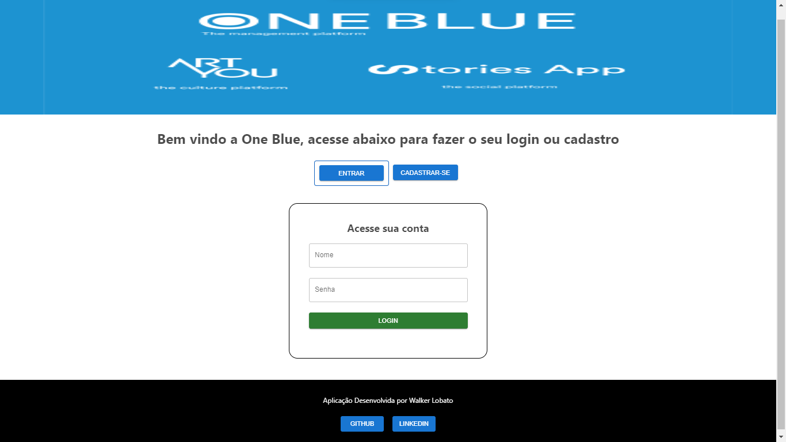
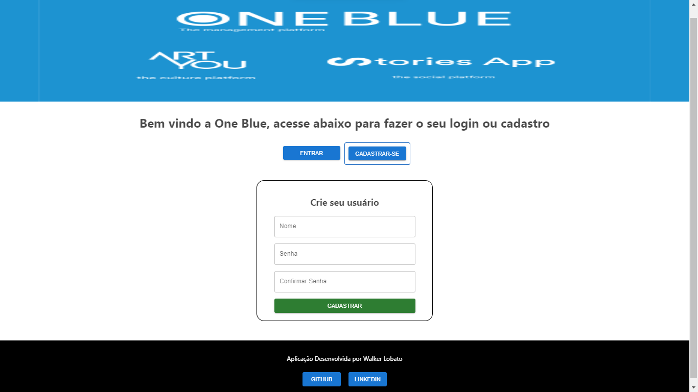

# **oneBlue-testeReacJS** 

> Teste Técnico para a Contratação de Desevolvedor Frontend na Empresa **OneBlue, Artyou Global & Stories App**. 

## **Descrição**
Aplicação front-end para interação visual com a API de cadastro de usuário e login;

## **Objetivos**
- Criar aplicação com ReactJs utilizando Yup e Material-UI;
- Tratativa de erros e validações;

## **Tecnologias**
Este projeto foi desenvolvido com as seguintes tecnologias: 
- JavaScript;
- ReactJs;
- React Hooks;
- React Router;
- Material-UI;
- Yup;
- Axius;

## **Requerimentos**
- Node.js;
- npm ou yarm;
- Backend: [https://github.com/oneblueapp/testing_react_js/](https://github.com/oneblueapp/testing_react_js/)

## **Instalação**
`npm install`

## **Clone do Projeto**
`git clone https://github.com/WalkerBrum/oneBlue-testeReactJS.git`

# 📷 Demonstração da Aplicação

## **Autor e Agradecimento**
Eu Walker Lobato como desenvolvedor do projeto sou grato por poder participar desse desafio, pois é um grande oportunidade para o desenvolvimento das minhas hard skills, aprimorando os meus conhecimentos na construção de aplicações web.

